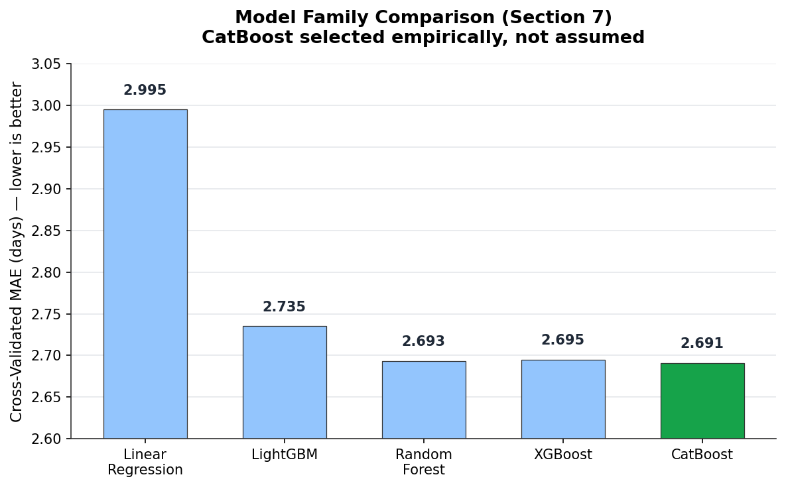
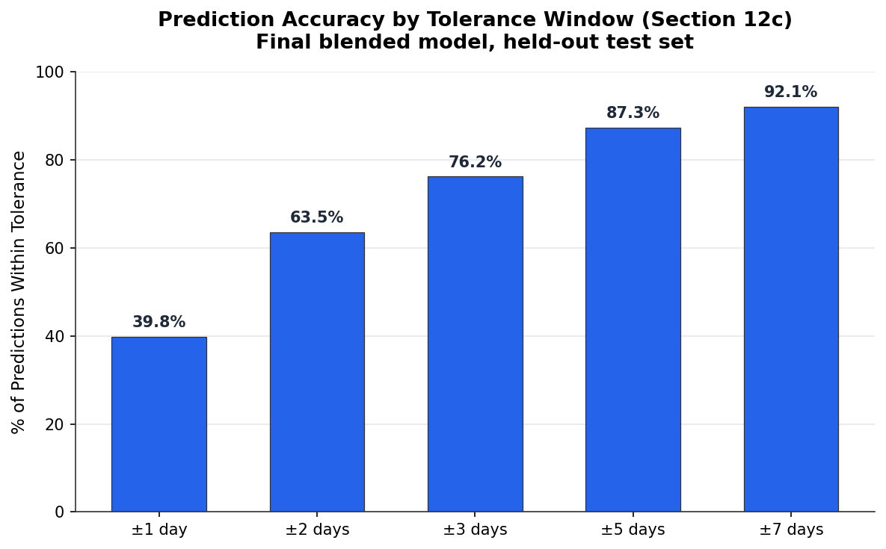
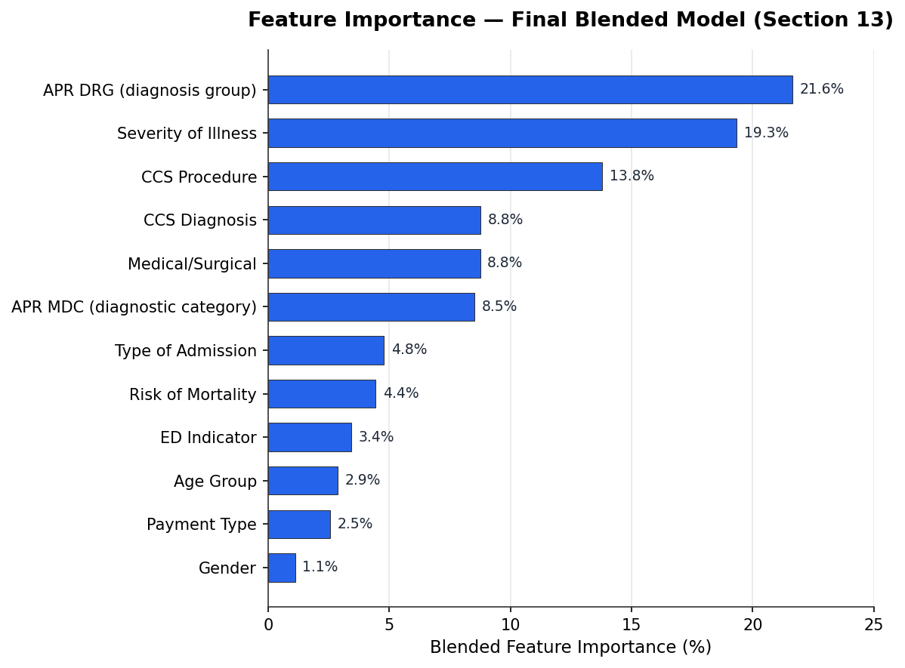

# Inpatient Length-of-Stay Prediction

[](https://inpatient-analysis-predicting-length-of-stay-xskqrmuty7keqyq9s.streamlit.app/)

**[Try the live app](https://inpatient-analysis-predicting-length-of-stay-xskqrmuty7keqyq9s.streamlit.app/)**

## Executive Summary

This project predicts inpatient hospital length of stay (in days) for adult patients from information available at admission, using a methodology-first workflow: the model family is compared empirically — under a preprocessing strategy fair to every candidate — *before* any commitment is made, and every subsequent decision (feature engineering, loss function, hyperparameter tuning) is built on the confirmed winner rather than an assumed one.

**Final result, on a held-out test set never used in any design decision:** R² = 0.390, MAE = 2.71 days, RMSE = 5.66 days, with 76% of predictions within 3 days of the true stay — in the range of the closest comparable published benchmarks for this task. The final model is deployed as an interactive Streamlit application.

---

## Table of Contents

- [Problem Statement](#problem-statement)
- [Data](#data)
- [Methodology](#methodology)
- [Key Results](#key-results)
- [Model Card](#model-card)
- [Known Limitations](#known-limitations)
- [Comparison to Published Literature](#comparison-to-published-literature)
- [Repository Structure](#repository-structure)
- [Deployment](#deployment)
- [Reproducing This Work](#reproducing-this-work)
- [Future Work](#future-work)

**For the full section-by-section technical methodology (all 16 notebook sections), see [`docs/METHODOLOGY.md`](docs/METHODOLOGY.md).**

---

## Problem Statement

Hospital bed capacity and staffing planning depend on knowing, as early as possible, how long an admitted patient is likely to stay. This project builds a regression model that predicts length of stay in days using only information available **at the time of admission** — diagnosis, procedure, severity, demographics, and administrative fields — with no information from later in the hospital stay.

## Data

**Source:** New York Statewide Planning and Research Cooperative System (SPARCS), 2015 — a state-mandated, all-payer database of inpatient hospital discharges (~2.35M records).

**Scope:** Adult patients (18+) only. Stays recorded as censored ("120+ days") were excluded from both training and evaluation, since their true length of stay is unknown rather than merely difficult to predict — including them would train and evaluate the model against an inaccurate label.

**Split:** A group-aware, stratified train/test split (`StratifiedGroupKFold`) is used rather than a plain random split — every row is grouped by a hash of its full feature+target combination, guaranteeing that identical feature+target rows never land on both sides of the split. This eliminates a specific form of train/test leakage found in an earlier iteration of this project (duplicate rows appearing in both splits).

## Methodology

Every major project decision in this codebase follows the same evidentiary standard: **a change is adopted only if it clears a pre-defined threshold under cross-validation, not "any" improvement however small** (a minimum-improvement threshold of 0.05% relative MAE is used throughout to filter out noise-level differences). Model comparisons report R², MAE, RMSE, and Median AE for both training and validation folds side by side, so overfitting is visible at the moment a candidate is evaluated rather than discovered later.

### 1. Model family selection *before* any downstream commitment
Five model families — LightGBM, CatBoost, XGBoost, Random Forest, and a Linear Regression baseline — were compared under an encoding strategy usable by every candidate, **before** any preprocessing or feature-engineering decision was made. This deliberately reverses a common pattern (choosing a model family on assumption, then building every later step around it): here, the model choice itself is the first empirical decision, not an unexamined starting assumption.

**CatBoost was selected.** The other four were excluded for three distinct, documented reasons:

| Model | Reason for exclusion |
|---|---|
| Linear Regression | **Accuracy** — clearly weaker raw performance |
| XGBoost | **Generalization** — competitive accuracy, but a Train-CV gap reaching up to 37.6% depending on configuration |
| Random Forest | **Operational cost** — competitive accuracy and an acceptable generalization gap, but substantially slower to train with no accuracy advantage to justify it |



### 2. Preprocessing strategy confirmed for the winning model specifically
Once CatBoost was confirmed, its native categorical-handling capability was tested directly against Target Encoding (the encoding used for the fair, cross-model comparison above). Target Encoding won — a finding specific to CatBoost, illustrating why encoding strategy should be tested per-model rather than assumed to generalize from one model family to another.

### 3. Feature-level experiments
Three hypotheses raised during exploratory analysis — dropping a highly-correlated column, and two engineered interaction features — were each tested individually. **None improved performance meaningfully.** This is reported as a legitimate finding, not a failure: it indicates the gradient-boosted model captures these relationships (redundancy, low-order interactions) internally without needing them engineered explicitly.

### 4. Loss function comparison and blending
L2 loss on a `log1p`-transformed target and a Tweedie loss (suited to right-skewed, heteroscedastic data like length of stay) were compared directly. Neither uniformly dominated: Tweedie improved R²/RMSE (better on the long right tail of extended stays) while L2+log1p improved MAE/Median AE (better on the large majority of typical-length stays). A weighted blend of the two models' predictions was derived as the mathematically optimal point under a stated constraint (best achievable MAE subject to R² remaining above a floor) — not a subjectively-chosen compromise.

### 5. Hyperparameter optimization, in two phases
A fast screening phase (a data sample, reduced fold count) narrowed the search space cheaply; the winning configuration from screening was then re-evaluated at full scale and full cross-validation confidence before being adopted. When the initial full-scale tuning result for the Tweedie model showed a concerning 16% Train-CV R² gap, a dedicated regularization pass reduced it to 5.3% at negligible cost to accuracy — a **dual eligibility criterion** (MAE gap AND R² gap must both clear their respective thresholds) was used specifically because a single ratio-based gap metric proved able to overstate a problem depending on the scale of the underlying metric.

### 6. Final evaluation
The test set was consulted **exactly once**, after every design decision above was finalized — model family, preprocessing, features, loss function, hyperparameters, and blend weight were all locked in using only cross-validated evidence beforehand. Cross-validated estimates held up closely on this genuinely unseen data (within 0.7% for every metric reported), evidence against the extensive CV-based decision process having overfit to the cross-validation folds themselves.

## Key Results

| Metric | Value |
|---|---|
| R² | 0.390 |
| MAE | 2.71 days |
| RMSE | 5.66 days |
| Median AE | 1.35 days |
| Predictions within ±3 days | 76.2% |
| Predictions within ±5 days | 87.3% |





## Model Card

**Model type:** A weighted blend (`0.60 × L2+log1p prediction + 0.40 × Tweedie prediction`) of two CatBoost regressors sharing the same Target-Encoded feature set and training data.

**Intended use:** Supporting hospital bed-planning and resource-allocation workflows. **Not intended for individual clinical decision-making.**

**Training data:** NY SPARCS 2015, adult patients only, censored (120+ day) stays excluded.

**Final hyperparameters:**
- L2+log1p: `depth=10, l2_leaf_reg=10, learning_rate=0.1, subsample=0.8`
- Tweedie: `depth=10, l2_leaf_reg=15, learning_rate=0.03, subsample=0.9, variance_power=1.5`

## Known Limitations

- **A specific, identified weak point:** patients with Schizophrenia or other psychotic disorders, and patients with an actual stay just under the 120-day exclusion boundary, are disproportionately represented among the largest prediction errors — consistently across every model configuration tested (not an artifact of one loss function or the blend specifically). This indicates a genuine limitation of the available features/data for this subgroup.
- **Weaker performance for higher-severity patients:** R² is lower for Major (0.21) and Extreme (0.28) severity patients than the overall average (0.39) — the subgroup most relevant to cost and planning impact is also the hardest to predict accurately.
- **Single state, single year:** trained exclusively on 2015 New York data; performance on other states, years, or healthcare systems is untested.
- **Adults only:** not trained on or evaluated for pediatric admissions.

## Comparison to Published Literature

The closest directly comparable published result is Jain et al. (*BMC Health Services Research*, 2024), which reports CatBoost as the best-performing model for length-of-stay regression on a comparable adult population (R²=0.43), comparing Linear Regression, Random Forest, and CatBoost — this study did not include XGBoost. A second independent study on Italian hospital administrative data also found CatBoost outperforming Random Forest for this task (R²=0.49). This project's result (R²=0.390) sits in a broadly comparable range, on a different dataset and feature set, without claiming a direct apples-to-apples comparison.

## Repository Structure

```
├── notebooks/
│   ├── README.md
│   └── Length_of_Stay_v6_new_build.ipynb   # the full, reproducible pipeline
├── docs/
│   ├── README.md
│   └── METHODOLOGY.md                      # detailed, section-by-section technical reference
├── models/
│   ├── README.md
│   ├── app.py                              # Streamlit app (generated by notebook Section 16)
│   ├── requirements.txt                    # deployment dependencies (generated by Section 15.6)
│   ├── deployment_config.json              # input options + blend weight (generated by Section 15)
│   ├── final_pipeline_L2_log1p.joblib
│   └── final_pipeline_Tweedie_regularized.joblib
├── requirements.txt                        # environment dependencies for running the notebook itself
├── LICENSE
└── README.md
```

For the full section-by-section methodology (all 16 notebook sections), see [`docs/METHODOLOGY.md`](docs/METHODOLOGY.md).

## Deployment

A Streamlit app (`models/app.py`) is generated directly by the notebook (Section 16) and reads its input options and model configuration from `models/deployment_config.json` (Section 15) at runtime — no input values are hard-coded in the app itself, so retraining the model and re-running Sections 15-16 keeps the deployed app in sync automatically. Streamlit Community Cloud looks for a dependency file either at the repository root or alongside the entrypoint script; `models/requirements.txt` (next to `app.py`) is used for the deployed app specifically, kept separate from the root `requirements.txt` used to reproduce the notebook's own environment.

## Reproducing This Work

1. Open the notebook in Google Colab (or a local Jupyter environment with a mounted equivalent of the checkpoint directory structure).
2. Run all cells sequentially (`Runtime → Run all`). The notebook is designed for full sequential execution or resumption from a prior full run — every computationally heavy step is checkpointed and will load its saved result instead of recomputing. Running an individual cell in isolation, without the earlier cells having run in the same session, is not supported.
3. A full run from an empty checkpoint directory takes several hours, dominated by the hyperparameter search (Section 11) and the initial model family comparison (Section 7); most of this cost is one-time and is skipped on any subsequent run via the checkpoint system.

## Future Work

- Investigate a dedicated approach (e.g., a specialized sub-model or additional features) for the Schizophrenia/psychotic-disorder subgroup and near-boundary long-stay cases identified as a shared weak point across every model configuration tested.
- Consider a segment-aware modeling approach for Major/Extreme severity patients specifically, given their outsized cost/planning relevance combined with comparatively weaker R².
- Validate on more recent and/or multi-state data before any operational deployment.
- A cost-prediction extension is a natural follow-on: total cost correlates strongly with length of stay in this data, making a predicted LOS a plausible input feature for a separate downstream cost model.

---

[](LICENSE)

## Contact

**Diaa Aldein Alsayed Ibrahim Osman**
[LinkedIn](https://www.linkedin.com/in/diaa-ibrahim-data/) · [GitHub](https://github.com/DiaaAldein)

© 2026 Diaa Aldein Alsayed Ibrahim Osman — released under the [MIT License](LICENSE).
