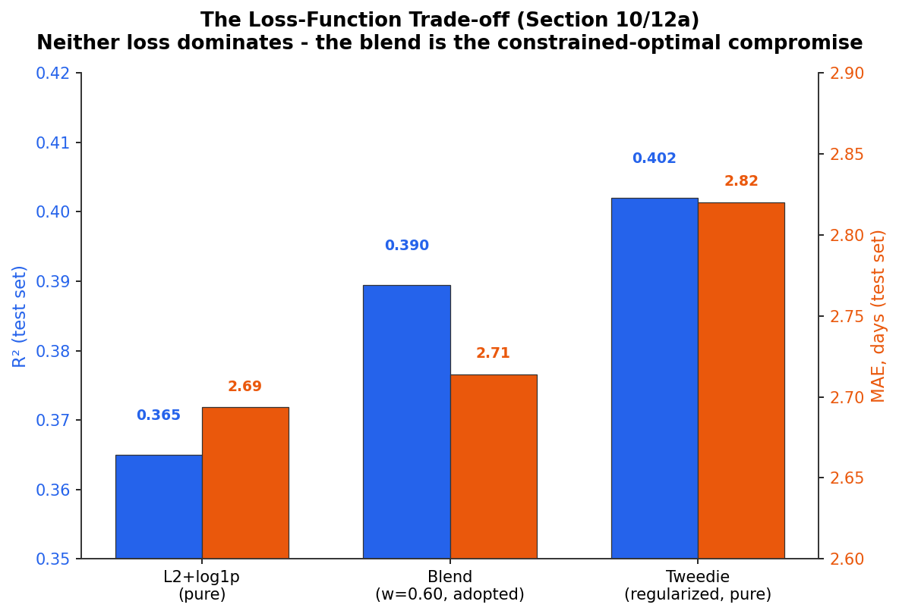
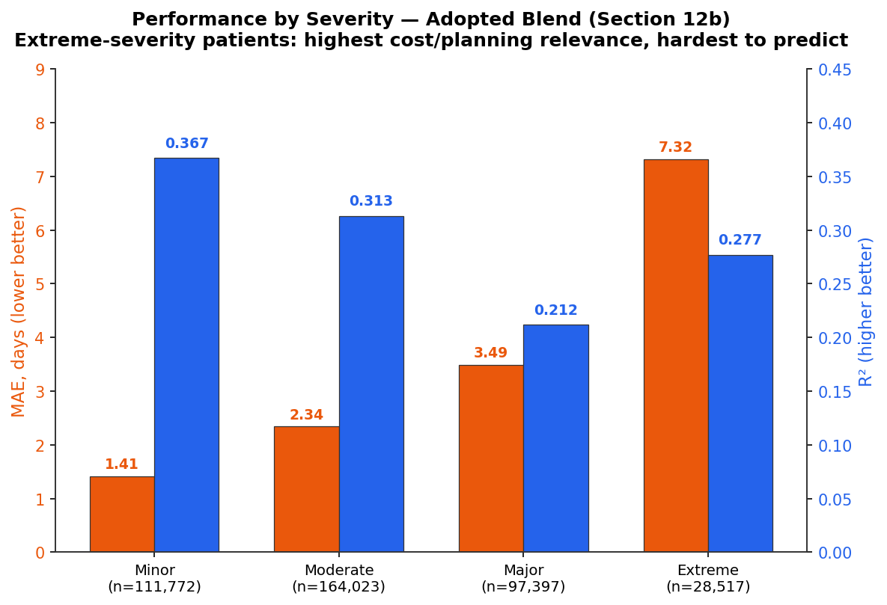

# Methodology — Detailed Section-by-Section Reference

## Executive Summary

This document is a technical companion to the top-level [README](../README.md), walking through every one of the 16 sections in `notebooks/Length_of_Stay_v6_new_build.ipynb` individually. The README covers the six major methodological phases at a high level, from initial model-family selection through final deployment; this document maps each phase to the specific notebook sections that implement it, with the reasoning behind every major decision, negative result, and correction made along the way.

---

## Table of Contents

- [Sections 1–3: Environment, Storage, and Data Acquisition](#sections-13-environment-storage-and-data-acquisition)
- [Section 4 / 4b: Cleaning and Exploratory Data Analysis](#section-4--4b-cleaning-and-exploratory-data-analysis)
- [Section 5: Feature Selection & Train/Test Split](#section-5-feature-selection--traintest-split)
- [Section 6: Universal Preprocessing Pipeline](#section-6-universal-preprocessing-pipeline)
- [Section 7 / 7b: Model Family Comparison](#section-7--7b-model-family-comparison)
- [Section 8: Model-Specific Preprocessing Check](#section-8-model-specific-preprocessing-check)
- [Section 9 / 9b / 9c: Feature-Level Experiments](#section-9--9b--9c-feature-level-experiments)
- [Section 10 / 10b / 10c: Loss Function Comparison & Blending](#section-10--10b--10c-loss-function-comparison--blending)
- [Section 11 (11 – 11f): Hyperparameter Optimization](#section-11-11--11f-hyperparameter-optimization)
- [Section 12 (12a – 12e): Final Evaluation](#section-12-12a--12e-final-evaluation)
- [Section 13: Feature Importance](#section-13-feature-importance)
- [Section 14: Summary, Model Card & Recommendations](#section-14-summary-model-card--recommendations)
- [Section 15: Deployment Preparation](#section-15-deployment-preparation)
- [Section 16: Streamlit App Generation](#section-16-streamlit-app-generation)

---

## Sections 1–3: Environment, Storage, and Data Acquisition

Sets up the reproducible execution environment and connects to persistent storage (Google Drive).

**Challenge:** Google Colab sessions can disconnect or reset unpredictably — including mid-run, sometimes after hours of progress on computationally expensive steps (the hyperparameter search in particular). Without a way to resume, any disconnect meant starting over from scratch.

**Solution:** A checkpoint system, defined here and used by every heavy step in the notebook from this point on. Each checkpoint is keyed to a **signature** — a hash computed from the exact state of the data and pipeline that produced it (row/column counts, encoding structure, and similar). Before recomputing anything expensive, the notebook checks for a saved result whose signature matches the *current* state: if found, it loads the saved result instantly instead of recomputing; if the signature doesn't match (because something upstream genuinely changed), it recomputes automatically rather than silently returning a stale result. This is what makes the notebook safely resumable after any disconnect, and safe to re-run after a code change without manually tracking what needs to be redone.

## Section 4 / 4b: Cleaning and Exploratory Data Analysis

**Challenge:** at 2.35M rows, loading and processing the raw dataset with default pandas dtypes consumed far more memory than necessary, slowing every subsequent step.

**Solution:** Section 4 downcasts every column to the smallest safe representation for its actual value range (e.g., 64-bit integers to 8/16/32-bit where the data's range allows, appropriate categorical/object types instead of generic wide types) rather than leaving default-inferred pandas dtypes. It also handles standard data-quality issues (missing values, inconsistent formatting) and flags censored stays (recorded as "120+" days) for later exclusion. Section 4b runs ten targeted exploratory questions, each answering a specific analytical question rather than serving as generic exploration — findings here (the target's skew, the strongest visual predictors, the prevalence of censored stays) directly motivate later design decisions (the `log1p` transform, the permanent row exclusion in Section 5, feature-level experiments in Section 9).

## Section 5: Feature Selection & Train/Test Split

Two decisions made here shape everything downstream:
- **Censored rows are permanently excluded** from both train and test sets — their recorded "120+" value is a floor on an unknown true value, not an accurate measurement, so keeping them anywhere would train or evaluate against an inaccurate label.
- **`StratifiedGroupKFold`**, not a plain random split, is used for the train/test split.

**Challenge:** dropping the columns not useful for prediction (this section) leaves many rows that describe genuinely different patients but are now identical across every remaining column, including the target (length of stay) itself — the feature space is coarser than the space of real individuals. A plain random split measured against this reality was found to place the *same* feature+target combination on both sides of the split for an estimated **70.8% of the test set** — meaning most of what looked like "unseen" test performance under a naive split was actually the model being scored on combinations it had already seen during training, not a genuine generalization measurement.

**Why the fix is not simply deleting the duplicates:** the duplication itself is not a data-entry error — it reflects real, natural variation in outcomes for patients who share the same recorded characteristics, and removing it would discard that real variance rather than any error. The leakage problem is specifically about *which side of the split* a duplicated combination lands on, not the duplication existing at all.

**Solution:** every row is grouped by a hash of its complete feature+target combination, and `StratifiedGroupKFold` guarantees each full group stays entirely on one side of the split — so identical combinations can never be divided between train and test. This preserves every row's contribution to the data's natural distribution while eliminating the leakage: a direct verification after the fix confirmed **zero cross-contaminated rows** between the final train and test sets.

## Section 6: Universal Preprocessing Pipeline

Builds one preprocessing pipeline (Target Encoding for high-cardinality columns, one-hot for low-cardinality, fixed ordinal mappings for clinical severity scales) usable identically by every model family compared in Section 7 — a deliberate choice to keep the upcoming model comparison fair, not biased toward whichever model happens to prefer this particular encoding.

**No feature scaling is used anywhere in this pipeline** — every model family compared, and the tree-based model ultimately adopted, makes decisions based on feature ordering within a tree, which is invariant to monotonic rescaling.

## Section 7 / 7b: Model Family Comparison

The methodological anchor of this project. Five model families (LightGBM, CatBoost, XGBoost, Random Forest, Linear Regression) are compared under Section 6's fixed encoding, before any preprocessing or feature decision specific to a model family is made. Section 7b resolves a statistical near-tie among the top three candidates (differences smaller than one standard deviation across folds) using a Train-vs-CV generalization gap as the deciding factor, since raw accuracy alone did not separate them with confidence.

**Result:** CatBoost adopted. Linear Regression excluded on accuracy; XGBoost excluded on generalization (Train-CV gap up to 37.6%); Random Forest excluded on operational cost (competitive accuracy, but substantially slower with no accuracy advantage).

## Section 8: Model-Specific Preprocessing Check

Tests CatBoost's native categorical-handling capability directly against Target Encoding — a check specific to the winning model, since encoding strategy is not assumed to generalize from the cross-model comparison in Section 7. Target Encoding won under a fully matched comparison (identical iteration budget for both candidates). A significant secondary finding here: CatBoost's default automatic search for combinations *between* categorical columns caused a severe, non-obvious slowdown with this dataset's high-cardinality columns; disabling it (`max_ctr_complexity=1`) resolved the issue without changing the underlying categorical handling itself.

## Section 9 / 9b / 9c: Feature-Level Experiments

Tests three hypotheses raised during Section 4b's exploratory analysis: dropping a column found highly correlated with others, and two engineered interaction features (severity×age, severity×ED-indicator). **None improved performance under a minimum-meaningful-improvement threshold** (0.05% relative MAE, used to filter out fold-to-fold noise rather than treating any nonzero difference as a real signal).

**Challenge:** this threshold was added *after* a logic bug was caught during review — the first version of the adoption check compared results with a strict "any improvement, however small" rule, and a candidate with an exactly 0.00% measured difference was incorrectly accepted as a pass due to a floating-point comparison edge case at the boundary. The bug was root-caused and fixed by introducing the explicit 0.05% threshold, applied retroactively to all three experiments in this section and consistently to every later experiment in the notebook.

This is reported as a legitimate, informative finding: it indicates CatBoost captures these relationships internally without needing them engineered explicitly, and the retained "redundant" column continues to carry real predictive weight in Section 13's feature-importance analysis.

## Section 10 / 10b / 10c: Loss Function Comparison & Blending

Compares an L2 loss on a `log1p`-transformed target against a Tweedie loss (suited to right-skewed, heteroscedastic targets) fit directly on the raw target. Neither dominated: Tweedie improved R²/RMSE (the long right tail of extended stays) while L2+log1p improved MAE/Median AE (the majority of typical-length stays). A blend of the two models' predictions is derived as the exact solution to a constrained optimization — maximum achievable MAE improvement subject to CV R² remaining above 0.39 — not a subjectively chosen compromise. This first pass (on the untuned models) settles on a blend weight of 0.40 (favoring Tweedie); Section 11f re-derives this same optimization on the tuned models once hyperparameter tuning is complete, and the optimal weight shifts to 0.60. Section 10c additionally tests — and rejects — applying Tweedie to an already-log-transformed target, confirming a theoretical concern (the two techniques address the same skew via conflicting assumptions) with direct experimental evidence.

## Section 11 (11 – 11f): Hyperparameter Optimization

A six-part sequence following a "cheap screen, expensive confirm" pattern throughout:
1. **11 / 11a2**: fast random search on a data sample, then a boundary-extension check when two parameters kept favoring the edge of the tested range.
2. **11b**: full-scale, full-confidence confirmation — reveals a 16% Train-CV R² gap for the tuned Tweedie model, well beyond every other gap in this project.
3. **11c / 11d**: a dedicated regularization search, screened cheaply then confirmed at full scale, reducing the gap to 5.3% at negligible cost to accuracy. This introduced a **dual eligibility criterion** (both an MAE gap and an R² gap threshold must be satisfied) after discovering that R²'s small absolute value can inflate a percentage-based gap metric relative to the same issue measured on MAE's scale.
4. **11e**: confirms the Tweedie distribution parameter (`variance_power`) is already near-optimal; no further tuning pursued once the potential gain became smaller than the cost of confirming it.
5. **11f**: re-derives the blend weight (Section 10b's methodology) on the tuned models — the optimal weight shifts from 0.40 to 0.60, with a genuine 2.1% MAE improvement over the untuned blend at an equivalent R².

## Section 12 (12a – 12e): Final Evaluation

The test set is consulted here for the first time — every design decision above was finalized using only cross-validated evidence beforehand. Cross-validated estimates held up within 0.7% of the actual test-set result for every metric. Sub-sections evaluate the adopted blend (and, for comparison, each pure model) from multiple angles: performance segmented by severity (12b), tolerance-based accuracy in plain-language terms (12c), a direct inspection of the worst-predicted individual cases (12d) — which surfaced a specific, reproducible weak point (Schizophrenia/psychotic-disorder diagnoses and near-120-day stays, consistent across every configuration tested) — and a final Train-vs-Test generalization check (12e).

## Section 13: Feature Importance

Combines both blended models' feature importances using the same weighting as the prediction blend itself (`0.60`/`0.40`), after confirming both models share an identical feature set. The result aligns with Section 4b's exploratory findings (severity and the clinical DRG classification lead) and confirms the column flagged as possibly redundant in Section 9 still carries real weight in the final model.

## Section 14: Summary, Model Card & Recommendations

The project's model card: intended use, training data scope, final hyperparameters, headline metrics, the model-family exclusion rationale (categorized as accuracy / generalization / operational cost), known limitations stated without minimization, and a comparison to the closest published benchmarks with explicit limits on what that comparison does and does not establish.

## Section 15: Deployment Preparation

Exports a single deployment manifest (`deployment_config.json`) — every valid categorical value (extracted directly from the training data, never hand-typed), the fixed ordinal scales, the final blend weight, and the model file names — plus an auto-generated `requirements.txt` derived from the live environment (`pip freeze`, filtered to the packages this project actually uses). Both artifacts are designed to stay in sync automatically: re-running this section after any retraining regenerates them from the current state, with no manual editing required downstream.

Also exports an MDC-to-DRG hierarchy map: Section 4b (Q5) found these two columns very strongly associated (Cramer's V ~0.91), because APR-DRG is, by clinical classification design, a sub-category of APR-MDC. This map lets the deployed app's DRG input cascade from the selected MDC, ruling out clinically invalid combinations by construction — a check first verified against the training data directly (most other column pairs tested this way did *not* show a near-hierarchical relationship strong enough to justify the same treatment, so this filtering was deliberately not extended beyond MDC/DRG).

**Challenge:** an early version of this section wrote `requirements.txt` using a relative path, which resolves against Colab's ephemeral `/content/` working directory rather than the persistent Google Drive location every other artifact in this notebook uses — the file appeared to save successfully but was silently lost on the next runtime restart. Fixed by using the same explicit, persistent `MODEL_DIR` path as every other saved artifact.

## Section 16: Streamlit App Generation

Generates the deployable `app.py` directly via `%%writefile`. Every input widget is populated from Section 15's manifest at runtime rather than hard-coded, so the deployed application's valid input options can never drift out of sync with what the underlying model was actually trained on — including the MDC-to-DRG cascading filter from Section 15, and inline help text for administrative/clinical fields whose meaning is not self-evident (e.g., APR MDC, APR DRG, Risk of Mortality).

**Three deployment-specific challenges surfaced only once the app was actually deployed, each diagnosed from its live error trace and fixed at the root:**

1. **Ephemeral storage, again:** like Section 15's `requirements.txt` issue, `%%writefile app.py` writes to the current working directory by default — fixed by explicitly changing the working directory to the persistent `MODEL_DIR` immediately before this cell runs.
2. **A Python version mismatch between training and deployment:** the deployment platform's default Python (3.10) could not satisfy a dependency (`scipy`) that required Python 3.11+, matching the version actually used during training in Colab. Fixed by explicitly configuring the deployment platform to use the matching Python version, rather than relaxing the dependency pin.
3. **A `joblib`/pickle deserialization failure:** `full_preprocessor` (Section 6) uses `FunctionTransformer(apply_ordinal_maps)` — `joblib` pickles a *reference* to this function's name and defining module, not its body, so loading the pipeline in a standalone script (which has no access to the original notebook's environment) failed with an `AttributeError` until an identically-named, identically-behaving copy of `apply_ordinal_maps` was defined directly inside `app.py`.

---

*For the full code, run each section sequentially in the notebook itself. For results and headline metrics, see the [README](../README.md).*

---

*Part of the [Inpatient Length-of-Stay Prediction](https://github.com/DiaaAldein/Inpatient-Analysis-Predicting-Length-of-Stay) project — Diaa Aldein Alsayed Ibrahim Osman ([LinkedIn](https://www.linkedin.com/in/diaa-ibrahim-data/)).*
